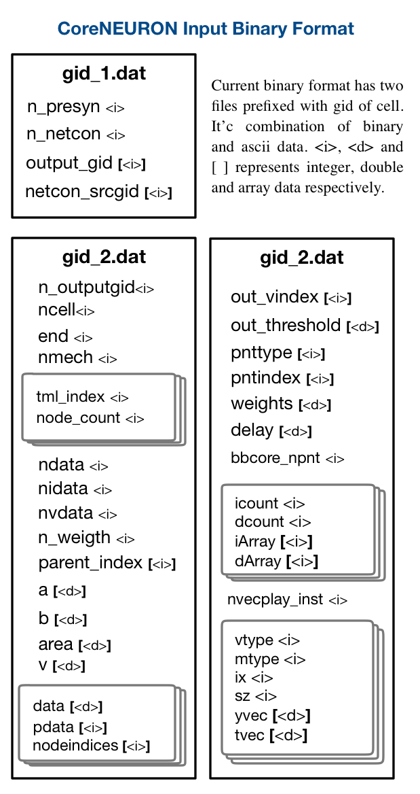

## CoreNEURON Input Binary File Format

NEURON is used for building in-memory model of the network. The in-memory representation of model is then dumped to binary files and read by CoreNEURON. The abstract structure of these binary files is shown : .

> Note : additional datasets are being added for additional functionality (e.g. Gap Junctions). This dcoumentation / format will be updated in the future.
